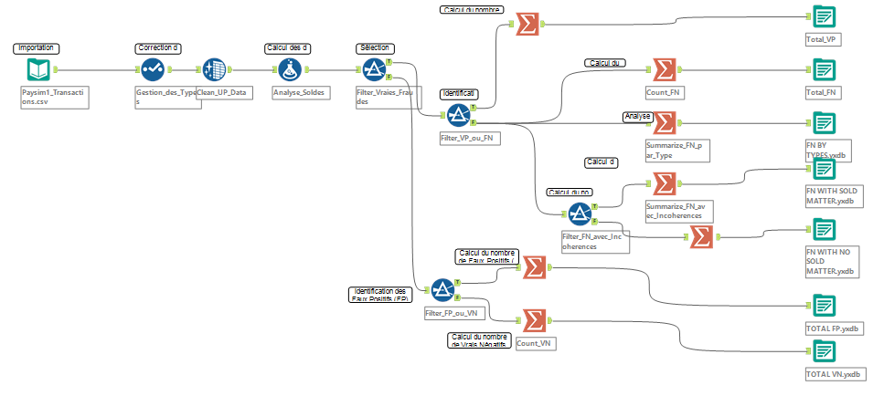

# Audit IT : Évaluation d'un Système de Détection de Fraude Bancaire avec Alteryx

##  Introduction

Ce projet documente un audit IT approfondi que j'ai mené pour évaluer l'efficacité d'un système de détection de fraude au sein d'une institution financière (basé sur le dataset `Paysim1`). Mon objectif était de quantifier les lacunes de détection, d'identifier les causes racines et de proposer des recommandations concrètes pour renforcer la sécurité.

##  Contexte et Enjeu

La fraude bancaire représente un risque financier et de réputation majeur. Un système de détection inefficace peut entraîner des pertes colossales. Cet audit a été conçu pour apporter des preuves tangibles de la performance du système anti-fraude en place et éclairer les décisions stratégiques.

##  Méthodologie et Outils

J'ai adopté une approche **data-driven** et **quantitative**, exploitant la puissance d'**Alteryx** pour toutes les étapes de l'analyse.

**Source des Données :**
Le dataset utilisé pour cette analyse est une simulation de transactions financières appelée **PaySim1**, disponible publiquement sur Kaggle.
* **Lien du dataset :** [https://www.kaggle.com/datasets/ealaxi/paysim15](https://www.kaggle.com/datasets/ealaxi/paysim15)

Mon workflow s'est articulé autour des phases suivantes :

1.  **Préparation et Qualité des Données :**
    * Nettoyage et conversion des types de données (passer de `V_String` à `Double` pour les montants et soldes).
    * Calcul d'indicateurs de cohérence interne : `Balance_Diff_Org` et `Balance_Diff_Dest` (différences entre les soldes attendus et réels).
    * *Voir [Workflows/WORKFLOW.yxmd](Workflows/WORKFLOW.yxmd) pour le workflow Alteryx et les images pour des détails d'étapes :*
        * 
        * 
        * 

2.  **Évaluation de la Performance du Système Anti-Fraude (`isFlaggedFraud` vs `isFraud`) :**
    * Construction d'une **matrice de confusion** pour quantifier :
        * Vrais Positifs (VP)
        * Faux Négatifs (FN)
        * Faux Positifs (FP)
        * Vrais Négatifs (VN)
    * *Voir la section pertinente du workflow pour la logique :*
        * 

3.  **Analyse des Causes Racines et des Caractéristiques des Fraudes Manquées :**
    * Corrélation des Faux Négatifs avec les incohérences de solde (`FN WITH NO SOLD MATTER` et `FN WITH SOLD MATTER`).
    * Analyse de la répartition des Faux Négatifs par type de transaction (`FN BY TYPES`).

##  Résultats Clés & Découvertes d'Audit

Les conclusions de cet audit sont significatives :

* **Intégrité des Données Compromise :**
    * Plus de **85%** des transactions présentaient des incohérences majeures dans les soldes émetteurs, et **75.5%** pour les destinataires. Ces écarts pouvaient atteindre des dizaines de millions d'euros, signalant des failles critiques dans la tenue de compte.
* **Système de Détection de Fraude Excessivement Inefficace :**
    * **Vrais Positifs (VP) : 16**
    * **Faux Négatifs (FN) : 8 197**
    * **Faux Positifs (FP) : 0**
    * **Vrais Négatifs (VN) : 6 354 407**
    * Le système ne détecte que **0.19%** des fraudes réelles, laissant passer la quasi-totalité des menaces.
* **Impact Financier Colossal des Fraudes Manquées :**
    * Les **8 197** fraudes non détectées représentent un montant cumulé stupéfiant de **11 978 629 864,15 €** (environ 12 milliards d'euros).
* **Pistes d'Amélioration Concrètes :**
    * **5 323** des fraudes manquées (soit ~65%) présentaient des **incohérences de solde**, une anomalie non exploitée par le système actuel.
    * Les fraudes non détectées sont presque exclusivement de type **TRANSFER (4081)** et **CASH_OUT (4116)**.

*Pour consulter les détails de chaque indicateur, veuillez télécharger les fichiers `.YXDB` depuis le dossier `OUTPUT/` de ce dépôt :*
* [OUTPUT/TOTAL%20VP.yxdb](OUTPUT/TOTAL%20VP.yxdb)
* [OUTPUT/TOTAL%20FN.yxdb](OUTPUT/TOTAL%20FN.yxdb)
* [OUTPUT/TOTAL%20FP.yxdb](OUTPUT/TOTAL%20FP.yxdb)
* [OUTPUT/TOTAL%20VN.yxdb](OUTPUT/TOTAL%20VN.yxdb)
* [OUTPUT/FN%20BY%20TYPES.yxdb](OUTPUT/FN%20BY%20TYPES.yxdb)
* [OUTPUT/FN%20WITH%20NO%20SOLD%20MATTER.yxdb](OUTPUT/FN%20WITH%20NO%20SOLD%20MATTER.yxdb)
* [OUTPUT/FN%20WITH%20SOLD%20MATTER.yxdb](OUTPUT/FN%20WITH%20SOLD%20MATTER.yxdb)

##  Recommandations Stratégiques

Basé sur ces constats, des actions urgentes sont nécessaires pour renforcer la posture de sécurité de la banque :

1.  **Refonte Urgente du Système de Détection :** Calibration ou remplacement des règles actuelles, avec une priorisation sur les types `TRANSFER` et `CASH_OUT`. L'exploration de solutions basées sur le Machine Learning est fortement recommandée.
2.  **Intégration des Vérifications de Cohérence de Solde :** Implémenter des règles automatiques signalant toute transaction présentant des anomalies dans les soldes, un indicateur puissant de fraude non exploité.
3.  **Audit et Renforcement des Processus de Tenue de Compte :** Corriger les causes racines des incohérences de données pour garantir la fiabilité des informations financières.
4.  **Mise en Place d'un Suivi Continu :** Développer des tableaux de bord pour surveiller en temps réel les performances du système anti-fraude.

##  Compétences Démontrées

Ce projet m'a permis de solidifier et de mettre en pratique des compétences clés en :

* **Audit des Systèmes d'Information (IT Audit)**
* **Analyse Exploratoire des Données (EDA)**
* **Qualité des Données et Data Wrangling**
* **Ingénierie des Données avec Alteryx**
* **Mesure de Performance & Quantification des Risques Financiers**
* **Détection de Fraude & Cybersécurité**
* **Formulation de Recommandations Stratégiques basées sur la Data**

## ✉ dikoume383@gmail.com

N'hésitez pas à me contacter si vous souhaitez échanger sur ce projet ou d'autres sujets liés à l'audit, l'analyse de données et la cybersécurité.
